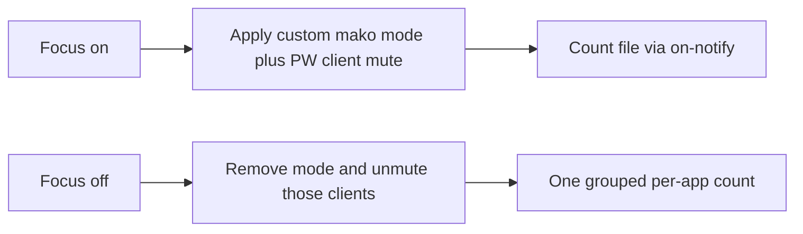

# Focus-mode distraction notification block

> HTML render lens: [.flow/artifacts/fn-2-focus-mode-distraction-notification/spec.html](../artifacts/fn-2-focus-mode-distraction-notification/spec.html) — regenerable, markdown is the record. <!-- flow-next:artifact-link -->

## Conversation Evidence

> user (turn 1): "next spec is that all notifications from distraction space should also be blocked. So during focus mode i don't want to get a notification from apps in distraction space."

## Overview

While focus mode is on, distraction-space apps send no banner and no sound. Other apps keep notifying. Focus off lifts this spec's mute, then one grouped notice lists a count per app that pinged (and may play one sound). Empty sessions skip that notice.

## Goal & Context
<!-- scope: business -->

The person using this plugin already hides the distraction workspace when focus mode is on. Those apps still send desktop banners and sounds, so a chat ping can break focus without the window being visible. Winning is a full focus session with zero banners and zero sounds from those apps. When focus turns off, one grouped notice lists a count per app that pinged, and may play one sound. Copy matches Omarchy's native voice, the same matter-of-fact tone as the bar eye and the 50-character reason field. This spec sits beside the network-destination block and can ship in either order.

## Architecture & Data Models
<!-- scope: technical -->

Focus on applies a per-app mute. Focus off lifts only the mute this spec applied. Membership is the shipped window-rule apps that belong to the distraction workspace, not fn-1's extra network destinations.

**Enforcement (resolved).** Omarchy's live notification stack is **mako**, not SwayNC.

- Manual hotkeys (learn.omacom.io/2/the-omarchy-manual/53/hotkeys). Super+, dismisses the latest. Super+Shift+, dismisses all. Super+Ctrl+, toggles silencing. Super+Alt+, invokes the most recent. The live binding file (`default/hypr/bindings/utilities.conf` on basecamp/omarchy master) maps those to `makoctl dismiss`, `makoctl dismiss --all`, `omarchy-toggle-notification-silencing`, and `makoctl invoke`. Super+Shift+Alt+, is `makoctl restore` (the manual page calls Super+Alt+, "invoke", not restore).
- Whole-desktop mute. `omarchy-toggle-notification-silencing` runs `makoctl mode -t do-not-disturb`. `default/mako/core.ini` then sets `[mode=do-not-disturb] invisible=true`, with `[mode=do-not-disturb app-name=notify-send] invisible=false` so Omarchy toasts still punch through. That mute hits every app. R2 forbids it. This spec never calls that binary and never toggles `do-not-disturb`.
- Per-app criteria already exist. The same `core.ini` has `[app-name=Spotify] invisible=1`. Themes style mako (`omarchy-restart-mako` is `makoctl reload`). `~/.config/mako/config` follows the active theme. App criteria that must survive a theme change belong in a persist-across-theme include, not in a theme `mako.ini`.
- Send path. `omarchy-notification-send` wraps `notify-send`. The plugin already uses that helper (with a `notify-send` fallback) for focus-on and focus-off toasts.
- Sound. Omarchy issue 5073 records that mako `invisible` / DND hides the banner and does not stop app-emitted sounds. Mako on this stack has no `on-notify` sound hook.

**Chosen mechanism.** A plugin-owned mako include that defines a **custom mode** (name `focus-distraction`, not `do-not-disturb`) with one `invisible=1` criterion per member app, plus `on-notify` that increments a count file. Apply adds the mode (`makoctl mode -a`). Lift removes it (`makoctl mode -r`). Sounds use a **PipeWire per-client mute** for matching sink-inputs only (WirePlumber / `pactl` or `wpctl`). Restore unmutes only the clients this spec muted. The default sink stays untouched.



**Identity map.** Banner match uses mako `app-name` when the app sets a distinct name, and `desktop-entry` for Chromium PWAs. Never match a bare `Google Chrome` / `Chromium` `app-name` (that would mute every Chrome site and fail R2). Sound match uses PipeWire `application.name` / `application.process.binary` / Chrome app id for the same members. Super+Alt+D of an unnamed class is not added to the mute set (no discovery UI).

**Count store.** A JSON object in XDG state, sibling of the focus flag. Keys are display labels. Values are integers. Nothing reads it into a UI while focus is on. Individual banners are never replayed.

**Hooks.** `enable_focus` applies. `disable_focus` lifts, then sends the grouped notice if any count is above zero. `listen` reapplies when the focus flag is on (login, crash, Hyprland events). Apply is idempotent.

**fn-1 overlap.** Both specs call from the same focus on/off hooks. This spec adds named apply/lift functions and does not take over the network block. No spec-level dependency. Either order can land.

## API Contracts
<!-- scope: technical -->

- `apply_notification_block() -> ok | fail`. Fail tells the user through the existing notify helper, rolls back any partial mutation (mako mode, include write, PW mutes), and leaves the previous notification and audio state unchanged. Focus still turns on (R8).
- `lift_notification_block() -> ok | fail`. Fail tells the user. Mutes this spec applied may remain until a later successful lift (R3). Focus can still turn off.
- Count file shape. `{ "<app-label>": <int>, ... }`. Missing file means zero pings. Successful grouped notice clears the file.
- Grouped notice. One `notify()` call. Body lists each app that pinged and its count. May play one sound. Zero apps means no grouped notice. The existing "Focus mode off" toast stays as the mode-change toast.
- Plugin toasts (`notify-send` / `omarchy-notification-send`) stay visible under the custom mode.

## Edge Cases & Constraints
<!-- scope: technical -->

- User Super+Ctrl+, DND stays independent. The custom mode stacks with `do-not-disturb`. This spec never toggles DND.
- Theme switch / `makoctl reload` can drop a custom mode. Apply is cheap and idempotent. `listen` reapplies while focus is on.
- Mako missing, `makoctl` missing, or another daemon owning `org.freedesktop.Notifications` is an apply fail (R8). A future Quickshell notification server on a non-master Omarchy branch is that case, not a second mechanism in this spec.
- Partial apply rolls back all of this spec's mutation.
- Rapid double-toggle. Apply and lift serialize on the existing listen lock or an equivalent file lock so two `focus` invocations cannot leave an orphan mode or a split count file.
- `focus-on` / `focus-off` share the same apply and lift as the zenity path.
- First install. `ensure_focus_default` plus `listen` apply the mute when the default is on.
- After lift-fail, the focus flag may read off while criteria still mute. The next successful lift (focus on then off, or a later lift call) is the retry. No extra UI.
- If the grouped notice send fails after a successful lift, keep the counts for a later successful notice. Do not replay individual banners.
- Chrome PWA desktop-entry strings are verified on a live Omarchy box against the shipped window-rule apps. The match rule (desktop-entry, not generic Chrome app-name) is the contract.

## Scope

In scope. Per-app banner hide and per-app sound mute for shipped workspace apps. Restore. One grouped count. README and manifest copy.

Out of scope. See Boundaries.

## Approach

1. Ship a plugin-owned mako include with `[mode=focus-distraction ...]` criteria. Add one `include=` line to the user persist-across-theme mako file (same install style as the Hyprland snippets). Never rewrite a theme `mako.ini` and never edit Omarchy `default/mako/core.ini` (upgrades overwrite it).
2. Map each shipped window-rule app to mako match keys and PipeWire client keys. Unit-test the map with fixtures. Live desktop-entry strings are an investigation check, not a new settings surface.
3. Hook apply/lift into the existing focus on/off/listen paths. Fail-closed apply. Snapshot-and-rollback. Do not call `omarchy-toggle-notification-silencing`.
4. Count via the criteria `on-notify` hook into the state file. No mid-focus reader.
5. On successful lift, send one grouped `notify()` if any count is above zero. May play one sound.
6. Document the mute and the catch-up in README and the plugin manifest.

## Quick commands

```bash
python3 -m py_compile distractions
python3 -m unittest discover -s tests -p 'test_*.py'
```

## Acceptance Criteria
<!-- scope: both -->

- **R1:** While focus mode is on, the user does not receive a notification from any app that belongs to the distraction space. Errors: if apply fails, the plugin tells the user and leaves the previous notification state unchanged. [paraphrase]
- **R2:** Notifications from apps that do not belong to the distraction space still appear while focus mode is on. Errors: no error surface beyond R1. [paraphrase]
- **R3:** Turning focus mode off restores notifications from the distraction-space apps. Errors: if the lift fails, the plugin tells the user and blocks may remain until a later successful lift.
- **R4:** After focus turns off, one grouped notice lists a count per distraction-space app that pinged. Errors: if nothing was blocked, show no notice. [user]
- **R5:** That grouped notice may play one sound. Errors: no error surface beyond R4. [user]
- **R6:** While focus is on, both the popup banner and the sound from those apps are blocked. Errors: no error surface beyond R1. [user]
- **R7:** There is no way to read blocked pings or a running summary while focus is on. Errors: no error surface beyond R1. [user]
- **R8:** If the mute cannot apply, the plugin tells the user, leaves pings as they were, and focus can still turn on. Errors: no error surface beyond R1. [user]

## Boundaries
<!-- scope: business -->

- Network destination blocking stays the sibling spec. This spec is notifications only. [paraphrase]
- Extra destinations that are not apps in the distraction space are not a notification-block set here. [paraphrase]
- A whole-desktop mute that blocks every app is out of scope. [inferred]
- Unread badges are out of scope. The user has no badge surface. [user]
- No history screen and no per-app notification toggles. Workspace membership is the list. [user]
- No allow-list and no urgent bypass. If the app lives in the space, it is silent until focus is off. [user]
- Agent-parsed "important things" summary is a later sibling spec. This spec ships a grouped count without an agent. [user]
- Super+Alt+D of an unnamed class is not added to the mute set.
- Individual blocked banners are discarded, not replayed.
- SwayNC is not the daemon and is not in scope.
- `omarchy-toggle-notification-silencing` / `do-not-disturb` is the user's own whole-desktop mute and is not this spec's apply path.

## Decision Context
<!-- scope: both -->

### Motivation
<!-- scope: business -->

Winning is a focus session with no banner and no sound from distraction-space apps. A grouped per-app count after focus-off is enough. Opening the apps after is how you catch up. A thin count is an accepted miss. The mute and the catch-up ship together. This work can ship before, after, or with the network block.

### Implementation Tradeoffs
<!-- scope: technical -->

Hiding the distraction workspace does not stop notification banners or sounds. The user asked for those notifications to be blocked while focus mode is on, scoped to apps in that space.

This is a sibling of the network-destination block. Same focus-mode gate. Different surface.

**D1 · daemon.** Chosen. Mako custom mode `focus-distraction` plus PipeWire per-client mute. Cited. Omarchy manual hotkeys, Omarchy CLI (`omarchy` has no per-app mute), `default/mako/core.ini`, `default/hypr/bindings/utilities.conf`, `omarchy-toggle-notification-silencing`, `omarchy-restart-mako`, `omarchy-notification-send`, `omarchy-notification-dismiss`, issue 5073. Rejected. Whole-desktop `makoctl mode -t do-not-disturb` (R2). Rejected. SwayNC (Omarchy does not ship it). Rejected. Editing theme `mako.ini` (theme switch would drop or fight the mute).

**D2 · membership.** Chosen. Shipped window-rule apps, mapped to mako `app-name` / `desktop-entry` and PipeWire client keys. Rejected. Muting every Chromium notification. Rejected. A settings list or runtime scanner for Super+Alt+D strays (declined extra UI).

**D3 · catch-up.** Chosen. Sidecar count file plus one grouped `notify()`. Rejected. Replaying each banner. Rejected. A mid-focus history screen (declined extra UI).

**D4 · exceptions.** Declined. `.flow/memory/declined/notification-exceptions.md`. No allow-list and no urgent bypass.

## Early proof point

Task fn-2-focus-mode-distraction-notification.1 proves a custom mako mode plus PipeWire client mute can hide banners and sounds for mapped apps only, without toggling `do-not-disturb`. If apply cannot stay per-app, or if it requires whole-desktop DND, stop and re-evaluate before the count and catch-up work.

## Requirement coverage

| Req | Description | Task(s) | Gap justification |
|-----|-------------|---------|-------------------|
| R1 | No banners from workspace apps while focus is on | fn-2-focus-mode-distraction-notification.1 | — |
| R2 | Other apps still notify | fn-2-focus-mode-distraction-notification.1 | — |
| R3 | Focus off restores this spec's mute | fn-2-focus-mode-distraction-notification.1, fn-2-focus-mode-distraction-notification.2 | — |
| R4 | One grouped per-app count after focus off | fn-2-focus-mode-distraction-notification.2 | — |
| R5 | That notice may play one sound | fn-2-focus-mode-distraction-notification.2 | — |
| R6 | Banner and sound both blocked | fn-2-focus-mode-distraction-notification.1 | — |
| R7 | No mid-focus reader | fn-2-focus-mode-distraction-notification.2 | — |
| R8 | Apply-fail tells the user, leaves prior state, focus still on | fn-2-focus-mode-distraction-notification.1 | — |

## Resolved via Project Docs

- `README.md`: Focus mode is on by default. Super+D is the only way into the distraction space, and only after focus is off. Turning focus off requires a zenity reason of at least 50 characters. The bar control is an eye icon.
- `.flow/specs/fn-1-focus-mode-network-distraction-block.md`: Sibling spec blocks network destinations while focus is on. This spec is notifications only.
- `CHANGELOG.md`, `STRATEGY.md`, `GLOSSARY.md`, `knowledge/decisions/`: absent.

## Resolved via Omarchy docs and config

- [Omarchy manual](https://learn.omacom.io/2/the-omarchy-manual)
- [Hotkeys / notifications](https://learn.omacom.io/2/the-omarchy-manual/53/hotkeys)
- [Omarchy CLI](https://learn.omacom.io/2/the-omarchy-manual/115/omarchy-cli)
- [omarchy-toggle-notification-silencing](https://github.com/basecamp/omarchy/blob/master/bin/omarchy-toggle-notification-silencing)
- [default/mako/core.ini](https://github.com/basecamp/omarchy/blob/master/default/mako/core.ini)
- [default/hypr/bindings/utilities.conf](https://github.com/basecamp/omarchy/blob/master/default/hypr/bindings/utilities.conf)
- [omarchy-notification-send](https://github.com/basecamp/omarchy/blob/master/bin/omarchy-notification-send)
- [omarchy-notification-dismiss](https://github.com/basecamp/omarchy/blob/master/bin/omarchy-notification-dismiss)
- [omarchy-restart-mako](https://github.com/basecamp/omarchy/blob/master/bin/omarchy-restart-mako)
- [Notifications are disabled but still makes a sound](https://github.com/basecamp/omarchy/issues/5073)

## References

- `distractions` focus gate and `notify()` helper
- `hypr/windows.lua` shipped workspace apps
- `.flow/memory/declined/notification-extra-ui.md`
- `.flow/memory/declined/notification-exceptions.md`
