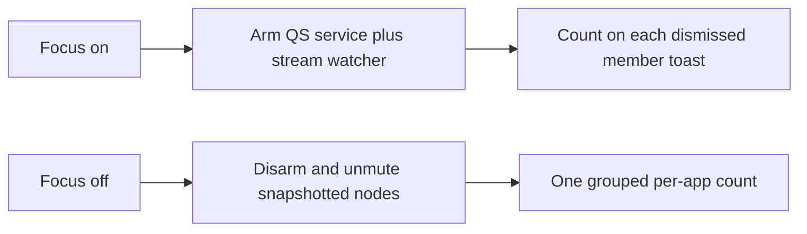

# Focus-mode distraction notification block

> HTML render lens: [.flow/artifacts/fn-2-focus-mode-distraction-notification/spec.html](../artifacts/fn-2-focus-mode-distraction-notification/spec.html) — regenerable, markdown is the record. <!-- flow-next:artifact-link -->

## Conversation Evidence

> user (turn 1): "next spec is that all notifications from distraction space should also be blocked. So during focus mode i don't want to get a notification from apps in distraction space."

## Overview

While focus mode is on, distraction-space apps send no banner and no sound. Other apps keep notifying. Focus off lifts this spec's mute, then one grouped notice lists a count per app that pinged (and may play one sound). Empty sessions skip that notice.

## Goal & Context
<!-- scope: business -->

The person using this plugin already hides the distraction workspace when focus mode is on. Those apps still send desktop banners and sounds, so a chat ping can break focus without the window being visible. Winning is a full focus session with zero banners and zero sounds from those apps. When focus turns off, one grouped notice lists a count per app that pinged, and may play one sound. Copy matches Omarchy's native voice, the same matter-of-fact tone as the bar eye and the 50-character reason field. This spec sits beside the network-destination block and can ship in either order.

## Architecture & Data Models
<!-- scope: technical -->

Focus on applies a per-app mute. Focus off lifts only the mute this spec applied. Membership is the shipped window-rule apps that belong to the distraction workspace, not fn-1's extra network destinations.

**Enforcement (resolved against the live Omarchy 4 stack).** The notification daemon is the Quickshell `NotificationServer` inside omarchy-shell. There is no mako and no dunst. This plugin already lives in that world (`BarWidget.qml` imports `Quickshell`, `qs.Commons`, `qs.Ui`).

Cited live sources (default branch of basecamp/omarchy, resolved as omacom/omarchy @ `b686ed89`, not stale `master`):

- [Omarchy manual](https://learn.omacom.io/2/the-omarchy-manual) and [hotkeys](https://learn.omacom.io/2/the-omarchy-manual/53/hotkeys). Super+, dismisses the latest. Super+Shift+, dismisses all. Super+Ctrl+, toggles silencing. Super+Alt+, invokes the most recent. The published manual still names some Omarchy 3 surfaces (waybar/mako in the theme chapter). The live daemon is Quickshell.
- [docs/notifications.md](https://github.com/basecamp/omarchy/blob/HEAD/docs/notifications.md). The shell claims `org.freedesktop.Notifications`. Decision logic lives in `NotificationLogic.js`.
- [docs/omarchy-shell.md](https://github.com/basecamp/omarchy/blob/HEAD/docs/omarchy-shell.md). Plugin kinds include `bar-widget` and `service`. Third-party services load from `shell.json` `plugins[]`. IPC is `omarchy-shell`.
- [default/hypr/bindings/utilities.lua](https://github.com/basecamp/omarchy/blob/HEAD/default/hypr/bindings/utilities.lua). Super+comma maps to `omarchy-shell notifications dismissOne` / `dismissAll` / `invokeLast`. Super+Ctrl+comma is the `notification-silencing` toggle. Super+Shift+Alt+comma is `showHistory`.
- [bin/omarchy-toggle-notification-silencing](https://github.com/basecamp/omarchy/blob/HEAD/bin/omarchy-toggle-notification-silencing). Runs `omarchy-shell notifications toggleDnd` and refreshes `omarchy.indicators`.
- `Service.qml`. DND is one boolean persisted as `dnd` in `~/.local/state/omarchy/notifications.json`. IPC exposes `toggleDnd`, `setDnd`, `dndState`, `dismissOne`, `dismissAll`, `dismiss(summary)`, `invokeLast`, `showHistory`. There is no per-app filter. A DND-silenced toast is written to history. Live toasts are mirrored as one JSON file each under `~/.local/state/omarchy/notifications/`.
- `NotificationLogic.js`. `shouldBypassDnd` lets through `app_name=omarchy-action` and critical `notify-send` only. Chat brands do not bypass. Snapshot identity is `app` (`appName`) plus `appIcon`.
- [docs/audio-tuning.md](https://github.com/basecamp/omarchy/blob/HEAD/docs/audio-tuning.md). Speaker DSP only. Restarting PipeWire drops Pulse clients. Not a per-app mute API.
- The published [Omarchy CLI](https://learn.omacom.io/2/the-omarchy-manual/115/omarchy-cli) page lists `omarchy` groups. It has no per-app notification mute. Plugin enable is `omarchy plugin enable` / `omarchy bar` as documented in `docs/omarchy-shell.md`.

**Whole-desktop mute still fails R2.** `toggleDnd` hides every non-bypass toast. This spec never calls `omarchy-toggle-notification-silencing`, `toggleDnd`, or `setDnd`.

**Chosen banner mechanism.** A plugin-owned Quickshell `service` entry (same imports and host injection as `BarWidget.qml`) that is armed while the focus flag is on.

1. Match incoming toasts by the identity map against `app` / `appIcon` (and desktop-entry when the sender sets one). Never match `omarchy-action` or `notify-send`.
2. Dismiss a match with `omarchy-shell notifications dismiss <summary>` (the only IPC that can take one toast without `dismissAll`).
3. Increment the count file for that member. Delete the matching live popup file and any history file this dismiss created, so Omarchy history is not a mid-focus reader (R7). Do not use the DND `writeSilenced` path.
4. Leave every non-member toast on screen.

`enable_focus` and `listen` (when the focus flag is on) apply. `disable_focus` lifts. Apply is idempotent. The service reads the focus flag from the existing XDG file, so a shell restart does not require a second source of truth.

Apply also ensures the service is actually loaded. Enabling a `bar-widget` writes `bar.layout` only. A dual-kind plugin must also appear in `shell.json` `plugins[]`. Apply adds that entry if missing, then `omarchy-shell shell rescanPlugins`. Lift does not remove the service from `plugins[]`. It only disarms the filter.

**Chosen sound mechanism.** The notification server does not play sounds. Apps emit them. PipeWire node properties cannot tell Chromium PWAs apart (review blocker). This spec does not mute by `application.name` of Chrome or Chromium.

Arm a **stream watcher** for the whole focus session (not a one-shot `pactl` of current sink-inputs).

- Native members (Telegram, Signal). Mute nodes whose `application.name` or `application.process.binary` maps to that member.
- Chromium PWA members. On each new node, read `/proc/<pid>/cmdline` for the shipped host or app-id (`discord.com`, `web.whatsapp.com`, `x.com`, `messages.google.com`). Mute only when that string is present. If cmdline is hidden or the ping is a chrome utility process without that id, leave the node unmuted. That is an accepted miss. Muting every Chromium event stream is not allowed (R2).
- New streams. The watcher evaluates every new node while armed. Snapshot each node id this spec mutes.
- Persistent configuration. The focus flag is the arming bit (already on disk). Autostart already runs `listen`. Apply starts or arms the watcher. Lift disarms it and unmutes only snapshotted node ids. A WirePlumber user drop-in is allowed only when it can load without restarting PipeWire or WirePlumber (those restarts drop clients). If a drop-in needs a restart, do not ship it. The watcher is the contract.
- Default sink stays untouched.



**Identity map.** Banner match uses notification `app` / `appIcon` (and desktop-entry when distinct). Chromium PWAs match the PWA host or brand, never a bare `Google Chrome` / `Chromium` `app`. Sound match uses the native PW keys or the cmdline host/app-id for the same members. Super+Alt+D of an unnamed class is not added to the mute set.

If a shipped member cannot be matched without also matching non-members, apply fails for the whole mute (R8). Focus still turns on. Early proof stops before count work.

**Count store.** A JSON object in XDG state, sibling of the focus flag. Keys are display labels. Values are integers. Nothing reads it into a UI while focus is on. Individual banners are never replayed.

**Hooks.** `enable_focus` applies. `disable_focus` lifts, then sends the grouped notice if any count is above zero. `listen` reapplies when the focus flag is on (login, crash, Hyprland events). Apply is idempotent.

**fn-1 overlap.** Both specs call from the same focus on/off hooks. This spec adds named apply/lift functions and does not take over the network block. No spec-level dependency. Either order can land.

## API Contracts
<!-- scope: technical -->

- `apply_notification_block() -> ok | fail`. Fail tells the user through the existing notify helper, rolls back any partial mutation (service arm, `plugins[]` add we just wrote, watcher arm, node mutes), and leaves the previous notification and audio state unchanged. Focus still turns on (R8).
- `lift_notification_block() -> ok | fail`. Fail tells the user. Mutes this spec applied may remain until a later successful lift (R3). Focus can still turn off.
- Count file shape. `{ "<app-label>": <int>, ... }`. Missing file means zero pings. Successful grouped notice clears the file.
- Grouped notice. One `notify()` call. Body lists each app that pinged and its count. May play one sound. The existing helper is the sender. This spec does not add a new sound player. Zero apps means no grouped notice. The existing "Focus mode off" toast stays as the mode-change toast.
- Plugin toasts (`omarchy-notification-send` / `notify-send`, including the default `omarchy-action` app name) stay visible under the filter.

## Edge Cases & Constraints
<!-- scope: technical -->

- User Super+Ctrl+, DND stays independent. This spec never toggles that boolean. When the user has DND on, non-member toasts stay silenced by Omarchy. Member toasts stay in our count path if the service still sees them; if DND swallows them into history before we match, treat that as Omarchy DND (not our catch-up) and do not invent a second history reader.
- Shell restart. The service reloads with omarchy-shell. The focus flag is the arming bit. `listen` reapplies the watcher while focus is on.
- Missing omarchy-shell, missing `NotificationServer` bus name, or a daemon that is still mako is an apply fail (R8). This spec has one mechanism (Quickshell). It does not keep a mako fallback.
- Dual-kind load. If `plugins[]` cannot be written or `rescanPlugins` does not load the service, apply fails and rolls back.
- Partial apply rolls back all of this spec's mutation.
- Rapid double-toggle. Apply and lift serialize on the existing listen lock or an equivalent file lock so two `focus` invocations cannot leave an armed watcher or a split count file.
- `focus-on` / `focus-off` share the same apply and lift as the zenity path.
- First install. `ensure_focus_default` plus `listen` apply the mute when the default is on.
- After lift-fail, the focus flag may read off while the filter or node mutes remain. The next successful lift (focus on then off, or a later lift call) is the retry. No extra UI.
- If the grouped notice send fails after a successful lift, keep the counts for a later successful notice. Do not replay individual banners.
- Dismiss-after-show may flash one frame. A flash that clears is an accepted miss. A toast that stays visible is an apply/proof fail.
- Chrome PWA `app` / desktop-entry / cmdline strings are verified on a live Omarchy 4 box against the shipped window-rule apps. The match rule (PWA identity, not generic Chrome) is the contract.
- A PWA notification sound whose chrome pid cmdline lacks the shipped host or app-id stays unmuted. That miss is recorded. Do not widen the mute to all Chromium audio.

## Scope

In scope. Per-app banner hide and per-app sound mute for shipped workspace apps. Restore. One grouped count. README and manifest copy.

Out of scope. See Boundaries.

## Approach

1. Add a Quickshell `service` entry next to `BarWidget.qml`. Arm it from `apply_notification_block`. Dismiss member toasts through `omarchy-shell notifications dismiss`. Count on dismiss. Drop matching history files we created.
2. Map each shipped window-rule app to notification `app` / `appIcon` / desktop-entry and to sound keys (native PW name, or chrome cmdline host/app-id). Unit-test the map with fixtures. Live strings are an investigation check, not a new settings surface.
3. Hook apply/lift into the existing focus on/off/listen paths. Fail-closed apply. Snapshot-and-rollback. Do not call `omarchy-toggle-notification-silencing` or `setDnd`.
4. Arm a stream watcher for the focus session so new nodes are evaluated. Snapshot muted node ids. Lift unmutes those ids only.
5. On successful lift, send one grouped `notify()` if any count is above zero. May play one sound through the existing helper. No new player.
6. Document the mute and the catch-up in README and the plugin manifest, including the `service` kind and `plugins[]` load.

## Quick commands

```bash
python3 -m py_compile distractions
python3 -m unittest discover -s tests -p 'test_*.py'
```

## Acceptance Criteria
<!-- scope: both -->

- **R1:** While focus mode is on, the user does not receive a notification from any app that belongs to the distraction space. Errors: if apply fails, the plugin tells the user and leaves the previous notification state unchanged. [paraphrase]
- **R2:** Notifications from apps that do not belong to the distraction space still appear while focus mode is on. Errors: no error surface beyond R1. [paraphrase]
- **R3:** Turning focus mode off restores notifications from the distraction-space apps. Errors: if the lift fails, the plugin tells the user and blocks may remain until a later successful lift.
- **R4:** After focus turns off, one grouped notice lists a count per distraction-space app that pinged. Errors: if nothing was blocked, show no notice. [user]
- **R5:** That grouped notice may play one sound. Errors: no error surface beyond R4. [user]
- **R6:** While focus is on, both the popup banner and the sound from those apps are blocked. Errors: no error surface beyond R1. A PWA sound whose process cmdline lacks the shipped host or app-id is the recorded miss under Decision Context, not a widening of the mute. [user]
- **R7:** There is no way to read blocked pings or a running summary while focus is on. Errors: no error surface beyond R1. [user]
- **R8:** If the mute cannot apply, the plugin tells the user, leaves pings as they were, and focus can still turn on. Errors: no error surface beyond R1. [user]

## Boundaries
<!-- scope: business -->

- Network destination blocking stays the sibling spec. This spec is notifications only. [paraphrase]
- Extra destinations that are not apps in the distraction space are not a notification-block set here. [paraphrase]
- A whole-desktop mute that blocks every app is out of scope.
- Unread badges are out of scope. The user has no badge surface. [user]
- No history screen and no per-app notification toggles. Workspace membership is the list. [user]
- No allow-list and no urgent bypass. If the app lives in the space, it is silent until focus is off. [user]
- Agent-parsed "important things" summary is a later sibling spec. This spec ships a grouped count without an agent. [user]
- Super+Alt+D of an unnamed class is not added to the mute set.
- Individual blocked banners are discarded, not replayed.
- SwayNC is not the daemon and is not in scope.
- `omarchy-toggle-notification-silencing` / Quickshell `doNotDisturb` is the user's own whole-desktop mute and is not this spec's apply path.
- A mako custom mode is not the mechanism. The live daemon is Quickshell.
- Muting every Chromium or Chrome audio node is out of scope.

## Decision Context
<!-- scope: both -->

### Motivation
<!-- scope: business -->

Winning is a focus session with no banner and no sound from distraction-space apps. A grouped per-app count after focus-off is enough. Opening the apps after is how you catch up. A thin count is an accepted miss. The mute and the catch-up ship together. This work can ship before, after, or with the network block.

### Implementation Tradeoffs
<!-- scope: technical -->

Hiding the distraction workspace does not stop notification banners or sounds. The user asked for those notifications to be blocked while focus mode is on, scoped to apps in that space.

This is a sibling of the network-destination block. Same focus-mode gate. Different surface.

**D1 · daemon.** Chosen. Plugin Quickshell `service` plus a session stream watcher. Cited. `docs/notifications.md`, `docs/omarchy-shell.md`, `Service.qml` IPC, `utilities.lua`, `omarchy-toggle-notification-silencing`, `NotificationLogic.js`, `docs/audio-tuning.md`, Omarchy manual hotkeys, this plugin's `BarWidget.qml`. Rejected. Whole-desktop `toggleDnd` (R2). Rejected. Mako custom mode (live daemon is Quickshell; host plan-review MAJOR_RETHINK). Rejected. SwayNC (Omarchy does not ship it). Rejected. Cloning `omarchy.notifications` (reserved `omarchy.*` ids, upgrade-fragile).

**D2 · membership.** Chosen. Shipped window-rule apps, mapped to notification `app` / `appIcon` / desktop-entry and to native PW keys or chrome cmdline host/app-id. Rejected. Muting every Chromium notification or audio node. Rejected. A settings list or runtime scanner for Super+Alt+D strays (declined extra UI).

**D3 · catch-up.** Chosen. Sidecar count file incremented when the service dismisses a member toast, plus one grouped `notify()`. Rejected. Replaying each banner. Rejected. A mid-focus history screen (declined extra UI). Rejected. Leaving dismissed member toasts in Omarchy history while focus is on (that would be a mid-focus reader).

**D4 · exceptions.** Declined. `.flow/memory/declined/notification-exceptions.md`. No allow-list and no urgent bypass.

**D5 · PWA sound bound.** Accepted miss. When a Chromium PWA ping is emitted by a process whose cmdline lacks the shipped host or app-id, that sound stays up. Widening the mute to all Chromium audio fails R2.

**D6 · toast flash.** Accepted miss. Dismiss-after-show may flash one frame. A toast that remains is a fail.

## Early proof point

Task fn-2-focus-mode-distraction-notification.1 proves the Quickshell service can hide banners for mapped apps only, and the stream watcher can mute matching nodes including new ones, without toggling DND and without muting bare Chrome. If apply cannot stay per-app, or if it requires `toggleDnd`, or if PWA identity only works as "all Chromium", stop and re-evaluate before the count and catch-up work.

## Requirement coverage

| Req | Description | Task(s) | Gap justification |
|-----|-------------|---------|-------------------|
| R1 | No banners from workspace apps while focus is on | fn-2-focus-mode-distraction-notification.1 | — |
| R2 | Other apps still notify | fn-2-focus-mode-distraction-notification.1 | — |
| R3 | Focus off restores this spec's mute | fn-2-focus-mode-distraction-notification.1, fn-2-focus-mode-distraction-notification.2 | — |
| R4 | One grouped per-app count after focus off | fn-2-focus-mode-distraction-notification.2 | — |
| R5 | That notice may play one sound | fn-2-focus-mode-distraction-notification.2 | — |
| R6 | Banner and sound both blocked | fn-2-focus-mode-distraction-notification.1 | PWA cmdline-miss is D5, not a second mute |
| R7 | No mid-focus reader | fn-2-focus-mode-distraction-notification.2 | — |
| R8 | Apply-fail tells the user, leaves prior state, focus still on | fn-2-focus-mode-distraction-notification.1 | — |

## Resolved via Project Docs

- `README.md`: Focus mode is on by default. Super+D is the only way into the distraction space, and only after focus is off. Turning focus off requires a zenity reason of at least 50 characters. The bar control is an eye icon.
- `.flow/specs/fn-1-focus-mode-network-distraction-block.md`: Sibling spec blocks network destinations while focus is on. This spec is notifications only.
- `CHANGELOG.md`, `STRATEGY.md`, `GLOSSARY.md`, `knowledge/decisions/`: absent.

## Resolved via Omarchy docs and config

- [Omarchy manual](https://learn.omacom.io/2/the-omarchy-manual)
- [Hotkeys / notifications](https://learn.omacom.io/2/the-omarchy-manual/53/hotkeys)
- [Omarchy CLI](https://learn.omacom.io/2/the-omarchy-manual/115/omarchy-cli)
- [docs/notifications.md](https://github.com/basecamp/omarchy/blob/HEAD/docs/notifications.md) (default branch, Quickshell `NotificationServer`)
- [docs/omarchy-shell.md](https://github.com/basecamp/omarchy/blob/HEAD/docs/omarchy-shell.md) (plugin kinds, `plugins[]`, IPC)
- [docs/audio-tuning.md](https://github.com/basecamp/omarchy/blob/HEAD/docs/audio-tuning.md) (speaker DSP; PipeWire restart drops clients)
- [bin/omarchy-toggle-notification-silencing](https://github.com/basecamp/omarchy/blob/HEAD/bin/omarchy-toggle-notification-silencing)
- [default/hypr/bindings/utilities.lua](https://github.com/basecamp/omarchy/blob/HEAD/default/hypr/bindings/utilities.lua)
- `shell/plugins/notifications/Service.qml` and `NotificationLogic.js` on the default branch
- [Notifications are disabled but still makes a sound](https://github.com/basecamp/omarchy/issues/5073) (app-emitted sounds; the server still does not play them)

## References

- `distractions` focus gate and `notify()` helper
- `BarWidget.qml` Quickshell bar widget
- `hypr/windows.lua` shipped workspace apps
- `.flow/memory/declined/notification-extra-ui.md`
- `.flow/memory/declined/notification-exceptions.md`
