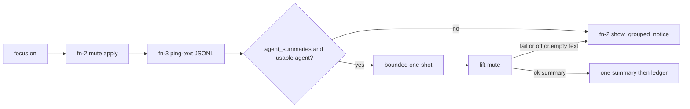

# Focus-mode agent notification summary

> HTML render lens: [.flow/artifacts/fn-3-focus-mode-agent-notification-summary/spec.html](../artifacts/fn-3-focus-mode-agent-notification-summary/spec.html) — regenerable, markdown is the record. <!-- flow-next:artifact-link -->

## Conversation Evidence

> user (turn 1): "summary is good. Note that we should spec out a feature where if user has an agent defined the user can configure the distraction-space to have the agent parse them during focus mode (inaccessible summary in the background) and one summary of important things will be presented at the end"
> user (turn 2): "yes capture that as fn-3"
> user (turn 3): "omarchy lets you define an agent and we should use the one the user has defined. The plugin should keep a ledger on what important means to the user. So the user could say summary not helpful or helpful and leave feedback. That'll be stored to inform the next summary parse."
> user (turn 4): "user will have to choose one but i think i can only enable one?"
> user (turn 5): "there's a default agent set"
> user (turn 6): "i guess you could override it to a cli app"
> user (turn 7): "any of the ones that omarchy allows as an agent"
> user (turn 8): "we should have basically the same selector modal that omarchy has for our summary agent"
> user (turn 9): "well any of them that allow headless invocation like claude -p or similar"
> user (turn 10): "the user needs to enable agent summaries in the plugin. Having an agent in omarchy doesn't immediately consent to agent summaries."

## Goal & Context
<!-- scope: business -->
<!-- Source-tag breakdown: 80% [user] / 20% [paraphrase] -->

The mute spec already hides banners and sounds, then shows a grouped per-app count when focus turns off. That count is a thin catch-up. This spec adds an optional path the user must turn on in the plugin. Having an Omarchy default agent is not consent. Once enabled, the plugin captures blocked-ping text itself, uses the default agent to read that text during focus, and shows one summary of important things when focus turns off. The user can override that default with the same kind of selector modal Omarchy already uses, limited to agents that can run a verified one-shot headless prompt. After each summary, the user can mark it helpful or not and leave feedback. That ledger shapes the next parse. Focus mode still works with agent summaries off. The grouped count stays the catch-up whenever this path is off or fails.

## Overview

This path stays off until `agent_summaries` is true in plugin config. The plugin then captures member-toast text into its own JSONL, resolves one usable Omarchy agent id, runs that agent's documented print/run/exec one-shot with the captured text plus the ledger, and holds stdout until focus turns off. The user sees one summary, then a helpful / not-helpful note. Mute still owns banners, sounds, and the grouped-count fallback. This spec does not read a raw ping queue from the mute spec. That queue does not exist.

## Architecture & Data Models
<!-- scope: technical -->
<!-- Source-tag breakdown: 70% [paraphrase] / 30% [inferred] -->

The mute spec owns apply/lift, banner dismiss, sound mute, the `{app-label: int}` count file, and `show_grouped_notice()`. This spec owns ping-text capture, the one-shot, the summary notice, and the ledger. It never applies or lifts mute.

**Ping-text capture (this spec owns it).** Planned mute stores only `{ "<app-label>": <int> }` and discards individual banners. This spec writes one JSONL record per member toast it observes while focus is on and `agent_summaries` is true. The writer is plugin Quickshell service code this spec adds. It does not dismiss the toast and does not increment the mute count. Membership is the same shipped distraction-space apps the mute spec maps. If mute's identity map is already in tree, reuse it. Do not invent a second membership list.

**Mute seam (thin contract, not a queue).** After a valid leave-focus reason, lift mute first. Then this spec chooses exactly one catch-up surface.

1. Summaries off, no usable agent, empty ping-text buffer, or any invoke/display failure. Call `show_grouped_notice()` so the mute catch-up still runs (R4, R6).
2. Success with a non-empty summary. Show one summary notice. Clear the count file silently. Do not call `show_grouped_notice()`.

`show_grouped_notice()` is a named function. If mute inlined the notice inside `disable_focus()`, this spec extracts that call so the notice cannot fire before the summary decision. When `agent_summaries` is false, `disable_focus()` keeps mute's lift-then-grouped-notice order unchanged. Empty ping-text with a nonzero count file uses the grouped notice. Capture miss must not hide mute's catch-up.

The existing "Focus mode off" toast stays.

**Consent and identity.** Plugin config gains `agent_summaries` (boolean, default false) and `summary_agent` (offered-table id or null). Null means "use Omarchy's default." Resolve the default with `omarchy default agent` (no args). That command prints the id in `~/.config/omarchy/defaults/agent` and prints nothing when unset ([Omarchy AI manual](https://omarchy.org/manual/ai/), [`bin/omarchy-default-agent`](https://github.com/basecamp/omarchy/blob/quattro/bin/omarchy-default-agent)). A plugin override does not write that Omarchy file. A rejected config write uses a temp-file rename and leaves the previous object unchanged.

**Picker.** Enable and override use `omarchy-menu-select`. That binary summons `omarchy.menu` in `mode: "select"` and blocks on a tempfile handshake ([`docs/menu.md`](https://github.com/basecamp/omarchy/blob/quattro/docs/menu.md), [`bin/omarchy-menu-select`](https://github.com/basecamp/omarchy/blob/quattro/bin/omarchy-menu-select)). It is the same visual plugin Omarchy uses as dmenu, which satisfies "same kind" (R12). It is not the Setup > Defaults > Agent submenu. That submenu is routed checked rows with actions. Select mode has no checkmarks. Agent row labels reuse `setup.default.agent.*` from [`default/omarchy/omarchy-menu.jsonc`](https://github.com/basecamp/omarchy/blob/quattro/default/omarchy/omarchy-menu.jsonc). The offered set is only ids in the offered table, plus an "Omarchy default" row on the override picker.

**Headless invoke.** The plugin does not call `omarchy agent` or `omarchy agent prompt`. Those launch an unattended interactive TUI with each agent's don't-stop-to-ask flags ([`bin/omarchy-agent`](https://github.com/basecamp/omarchy/blob/quattro/bin/omarchy-agent), [`bin/omarchy-agent-prompt`](https://github.com/basecamp/omarchy/blob/quattro/bin/omarchy-agent-prompt), [legacy Omarchy CLI page](https://learn.omacom.io/2/the-omarchy-manual/115/omarchy-cli)). The current Quattro manual is [omarchy.org/manual](https://omarchy.org/manual/) and [omarchy.org/manual/ai](https://omarchy.org/manual/ai/). The plugin spawns the agent's own one-shot from the offered table, passes ping text plus ledger as the prompt, and captures stdout. Shared spawn rules for every row. Dedicated empty cwd (not `$HOME`, not the plugin tree). Process group. Sanitized environment. No session-resume flags. No auto-approve / yolo / bypass-permissions flags.

Offered table (exact argv). Prompt on stdin unless noted. Omarchy ids from `omarchy-default-agent` that have a documented tool-free print/run/exec.

| id | Argv | Prompt | Source |
|----|------|--------|--------|
| claude | `claude -p --output-format text --tools "" --max-turns 1` | stdin | [Claude Code CLI](https://code.claude.com/docs/en/cli-reference) |
| codex | `codex exec --sandbox read-only --skip-git-repo-check` | stdin | [Codex CLI `exec`](https://developers.openai.com/codex/cli/reference.md) (read-only default) |
| grok | `grok -p` | next argv token | Grok Build print mode (no `--always-approve`) |
| omp | `omp --print --no-tools` | argv or stdin | [Oh My Pi print](https://github.com/can1357/oh-my-pi) plus `--no-tools` |
| agy | `agy -p` | argv | [Antigravity headless](https://antigravity.google/docs/cli/headless/) |

Dropped from the picker (unsafe or incorrect one-shot). `ori` (Omarchy's `ori code` prompt-alone path is wrong. Ori wants `ori code -p` / `--prompt-file` and defaults to approving command asks). `pi` (tools on, no permission popups. Old placeholder argv was not a closed vector). `copilot` (Omarchy launches `copilot --allow-all --interactive`. Print mode without `-s` pollutes stdout).

Omitted until a documented tool-free one-shot exists. `opencode` (`opencode run` is non-interactive. No verified no-tools flag). `crush` (`crush run` is a one-shot. Tool permissions stay on and `crush run` is treated as yolo).

An Omarchy default that is dropped or omitted is not a usable summary agent. Resolve it as empty (R7 then R4). If the user enables summaries while the resolved id is unusable and no override is set, tell them and leave grouped-count catch-up in place.

Empty stdout, non-zero exit, missing binary, timeout, or an id outside the offered table is a parse failure (R1 then R6). `agy -p` can exit 0 with empty stdout on a non-TTY. Treat that as R1.

**Parse bounds (deterministic).** One active child. First record after summaries are on starts the first one-shot. Replacement runs only after the child exits, after a 20 second debounce, and only when unseen records exist. At most 3 invocations per focus session, including one optional final parse at focus-off. Prompt payload is at most 40 records and 24 KiB of concatenated title plus body. Drop oldest records first and tell the model that older pings were truncated. Child timeout is 60 seconds, then kill the process group. Over budget uses the last valid non-empty stdout, or R6 if none. Enabling summaries mid-session arms capture on the next member toast. It does not rewrite already-dismissed toasts.

**Result storage.** Stdout lands in an XDG state file, mode `0600`, bound to a per-session id, published by atomic rename, flocked like `listen()`. R2 means no plugin UI or CLI reads it while focus is on. Same-user filesystem read is outside the product threat model. Delete the file on focus-on reset, successful focus-off, cancel, and startup recovery. A missing or stale session id is R1.

**Focus-on.** After mute apply (when present), arm capture if summaries are on. Cancel any leftover child. Discard unread stdout.

**Focus-off.** Valid reason. Lift mute. Wait once for an in-flight child (60 s, then kill). If unseen records remain and the invocation budget is not spent, run one final bounded parse. Then the XOR above. Reason zenity cancel stays focused and shows neither summary nor grouped notice.

**Ledger dialog.** After a shown summary, `omarchy-menu-select` offers Helpful and Not helpful. Cancel (exit 1) skips the ledger. Then an optional zenity note. Do not model this on `prompt_reason()`. That pattern cannot tell Not helpful from cancel.



## API Contracts
<!-- scope: technical -->

Plugin config in `~/.config/omarchy/focus.json` (existing `log` key unchanged):

```json
{
  "log": "~/.local/state/omarchy/focus-disable.log",
  "agent_summaries": false,
  "summary_agent": null
}
```

`summary_agent` is null or one offered-table id. A rejected write leaves the previous object unchanged.

Ping-text record this spec writes (not the mute count file):

```json
{ "app": "string", "title": "string", "body": "string", "at": "ISO-8601" }
```

Mute count file this spec may clear after a shown summary, and otherwise leaves to `show_grouped_notice()`:

```json
{ "<app-label>": 1 }
```

Ledger line, append-only JSONL at `~/.local/state/omarchy/focus-summary-ledger.jsonl`. The next prompt includes at most the last 20 lines and 4 KiB.

```json
{ "at": "ISO-8601", "helpful": true, "note": "string" }
```

`note` may be empty. A rejected line is not appended. Cancel does not append.

CLI additions on `distractions`, same style as `focus` / `focus-status`:

- `agent-summaries` opens the select modal for on / off and writes `agent_summaries`.
- `summary-agent` opens the select modal for offered-table ids and writes `summary_agent`, or clears the override when the user picks "Omarchy default".
- No command prints the running parse, the ping-text file, or the result file while focus is on.

Named mute functions this spec calls and does not reimplement. `lift_notification_block()`, `show_grouped_notice()`, `clear_counts()`. If those names are absent when this spec lands, extract them from the mute lift path without changing off-path behavior.

## Edge Cases & Constraints
<!-- scope: technical -->

- Empty ping-text at focus-off. No summary, no ledger prompt. Grouped notice still runs if mute has counts.
- Summaries on, Omarchy default unset or unusable, no override. R4.
- Binary missing or id not in the offered table. R1 at focus-off, then R6.
- Child still running at focus-off. One 60 s wait, then kill, then R1 and R6 unless a prior valid result exists.
- SIGINT or crash of `distractions` while a child is running. Next focus-off treats a missing or stale session result as R1.
- Two focus toggles at once. Flock the result, ping-text, and ledger files. The bar already skips a second `Process` while one runs. Super+Ctrl+Shift+F can still race the CLI.
- Focus-on during an in-flight parse. Cancel the child. Discard unread stdout. Start fresh if summaries are still on.
- Reason zenity cancel. Stay focused. Do not show a summary. Do not show a grouped notice.
- Ledger write failure after a shown summary. Tell the user. Keep the summary. Next parse may lack the new line (R10).
- Picker cannot open (`omarchy-menu-select` missing or cancel). Previous setting stays. Tell the user (R12).
- `agy -p` empty stdout on a pipe. R1, not a silent success.
- Summary `notify()` failure. Do not clear counts. Call `show_grouped_notice()` (R6).
- Enable mid-session. Arm capture on the next member toast. No backfill.
- Attacker-controlled toast body is prompt input. Offered-table tool-free flags and empty cwd are the mitigation. Dropped agents stay dropped.

## Acceptance Criteria
<!-- scope: both -->

- **R1:** When agent summaries are on and a usable agent is resolved, that agent parses this spec's blocked-ping text in the background while focus mode is on. Errors: if the parse fails, the plugin tells the user when focus turns off, then R6. [paraphrase]
- **R2:** The running parse and any in-progress summary stay inaccessible in the plugin UI and CLI until focus turns off. Errors: no error surface beyond R1. Same-user filesystem read of the `0600` session file is outside this product. [user]
- **R3:** When focus turns off and a usable agent produced a non-empty summary, the user sees one summary of important things, not each original ping. Errors: if the summary cannot be shown, the plugin tells the user and R6 applies. [user]
- **R4:** When summaries are off, no usable agent is resolved, or ping-text is empty, this spec does not change the mute spec's grouped-count catch-up. Errors: no error surface. [paraphrase]
- **R5:** The user can point the plugin at an agent they already have, without rebuilding or reinstalling. Errors: a rejected setting leaves the previous agent setting unchanged. [paraphrase]
- **R6:** If the agent path fails, the mute spec's grouped-count notice still applies. Errors: no error surface beyond R1 and R3. The notice must still be callable after lift. Do not wait for an agent after the notice has already been sent and cleared.
- **R7:** When no override is set, the plugin uses Omarchy's default agent if that id is in the offered table. Errors: if Omarchy has no default agent, or the default is dropped or omitted, R4 applies. [user]
- **R8:** The user can override the default to an offered-table Omarchy agent. Errors: a rejected override leaves the previous setting unchanged. [user]
- **R9:** After a summary, the user can mark it helpful or not helpful and leave feedback. Errors: cancel skips the ledger entry. A rejected note is not stored. Earlier ledger entries stay. Helpful and not-helpful are distinct from cancel. [user]
- **R10:** The plugin stores that feedback in a ledger that informs the next summary parse. Errors: if the write fails, the plugin tells the user. The summary already shown stays. The next parse may lack the new entry. [user]
- **R11:** The override set is only Omarchy-allowed agents that support a verified one-shot headless prompt with no interactive session and a tool-free contract. Errors: an agent that cannot run that way is not offered. [user]
- **R12:** The override picker is the same kind of selector modal Omarchy uses (`omarchy.menu` select mode). Errors: if the picker cannot open, the previous setting stays and the plugin tells the user. [user]
- **R13:** Agent summaries stay off until the user enables them in the plugin. An Omarchy default agent alone does not turn them on. Errors: while off, R4 applies. [user]
- **R14:** This spec owns blocked-ping text capture. It does not read a raw notification queue from the mute spec. Errors: append failure treats the session as empty ping-text for the summary path (R4). Mute counts stay unchanged. [paraphrase]
- **R15:** Parse cost is bounded. One active child, 20 s debounce, 3 invocations per session, 40 records, 24 KiB, 60 s timeout, one optional final parse at focus-off. Errors: over budget stops invoking and uses the last valid summary or R6. [paraphrase]

## Boundaries
<!-- scope: business -->

- Notification mute, banners, sounds, and the no-agent grouped count stay the mute spec. [paraphrase]
- Network destination blocking stays the network spec. [paraphrase]
- Focus mode does not require an agent, and an Omarchy default agent is not consent to send pings to it. [user]
- Peeking at the running parse while focus is on is out of scope. [user]
- An override that is not an Omarchy-allowed agent, or that cannot run a verified tool-free one-shot, is out of scope. [user]
- `omarchy agent prompt` and any interactive TUI launch are out of scope.
- `ori`, `pi`, and `copilot` are out of the picker. `opencode` and `crush` stay out until a documented tool-free one-shot exists.
- A history screen of past summaries and per-app notification toggles stay declined (`.flow/memory/declined/notification-extra-ui.md`).
- Allow-lists and urgent bypass stay declined (`.flow/memory/declined/notification-exceptions.md`).
- Changing Omarchy's own default-agent file from this plugin is out of scope.
- A second agent catalog is out of scope. Offered ids are the Omarchy list minus dropped and omitted rows.

## Decision Context
<!-- scope: both -->

### Motivation
<!-- scope: business -->

The mute spec's grouped count is enough to ship. The user asked for a later path where an agent reads the blocked pings during focus and returns one important-things summary at the end.

The agent is Omarchy's default agent, and only after the user enables agent summaries in this plugin. The user can override it through the same kind of selector modal Omarchy already uses. The offered set is only agents Omarchy allows that can run a verified one-shot headless prompt. The plugin does not invent its own agent list.

What counts as important is a ledger. Helpful / not-helpful plus optional feedback after each summary shapes the next parse.

This is a sibling of the mute spec, not a rewrite of it. Same focus-mode gate. Different surface.

### Implementation Tradeoffs
<!-- scope: technical -->

Host plan-review MAJOR_RETHINK (head 611de37) required this replan. Local mute spec on this branch is still the interview draft. Planned mute on `fn-2-focus-mode-distraction-notification` @ `1034c134` is the sibling contract used here.

**D1 · invoke (kept).** Read `omarchy default agent`. Pick with `omarchy-menu-select`. Run the offered argv table. Do not call `omarchy agent prompt`.

**D2 · consent (kept).** `agent_summaries` defaults false. An Omarchy default agent is not consent (R13).

**D3 · ping text.** This spec owns JSONL capture in a plugin service. Rejected. Depending on a mute raw-ping queue. Mute does not write one and discards banners.

**D4 · focus-off XOR.** Lift, then one summary with silent count clear, or `show_grouped_notice()`. Rejected. Waiting after `disable_focus()` and "suppressing" a notice that already fired.

**D5 · offered table.** Keep claude, codex, grok, omp, agy with exact tool-free argv. Drop ori, pi, copilot. Omit opencode and crush. Rejected. Shipping placeholder or interactive argv as a closed table.

**D6 · bounds.** 40 records, 24 KiB, one child, 20 s debounce, 3 invocations, 60 s kill, one final parse. Rejected. "A replacement parse may run" with no cap.

**D7 · picker parity.** Same visual plugin in select mode. Rejected. Claiming it is the Setup > Defaults > Agent submenu. Checkmarks are not required.

**D8 · ledger.** `omarchy-menu-select` for Helpful / Not helpful. Cancel skips. Rejected. A zenity question copied from `prompt_reason()`.

**D9 · tests.** Mocked unit tests for argv, opt-in, bounds, XOR fallback, and ledger three-state. The first plan's `py_compile`-only smoke is not enough once mute adds `tests/`.

Rejected extra notification UI and mute exceptions stay closed. See `.flow/memory/declined/notification-extra-ui.md` and `.flow/memory/declined/notification-exceptions.md`.

## Resolved via Project Docs

- `README.md`. Focus mode is on by default. Super+D is the only way into the distraction space, and only after focus is off. Turning focus off requires a zenity reason of at least 50 characters. The bar control is an eye icon.
- Planned mute spec on branch `fn-2-focus-mode-distraction-notification`. Sibling mute plus grouped-count catch-up. Count file only. No raw ping queue. This spec keeps that count as the fallback.
- `.flow/specs/fn-1-focus-mode-network-distraction-block.md`. Sibling network block. This spec does not take it over.
- `.flow/memory/declined/notification-extra-ui.md`. No history screen, no per-app toggles.
- `.flow/memory/declined/notification-exceptions.md`. No allow-list, no urgent bypass.
- [Omarchy 4 AI manual](https://omarchy.org/manual/ai/), [Omarchy CLI (legacy Omarchy 3 page)](https://learn.omacom.io/2/the-omarchy-manual/115/omarchy-cli), quattro `bin/omarchy-default-agent`, `bin/omarchy-agent`, `bin/omarchy-agent-prompt`, `bin/omarchy-menu-select`, `docs/menu.md`, `default/omarchy/omarchy-menu.jsonc`.

## Resolved via Codebase

- `enable_focus()` / `disable_focus()` are the hook points. Today they only flip the focus flag and toast.
- zenity reason pattern is cancel-safe for leave-focus. Do not reuse it for helpful / not-helpful.
- `notify()` via `omarchy-notification-send`, default 4000 ms. Summary notice uses 12000 ms.
- `load_config()` for `focus.json`.
- `fcntl` flock pattern on the listen lock, reused for result / ping-text / ledger.
- `focus.json` ships `log` only.
- `manifest.json` is `kinds: ["bar-widget"]` today. Capture needs a service entry.
- Bar stays the eye toggle. No settings schema.

## Quick commands

```bash
python3 -m py_compile distractions
python3 -m unittest discover -s tests -p 'test_*.py'
./distractions focus-status; echo $?
./distractions agent-summaries
./distractions summary-agent
```

## Early proof point

Task fn-3-focus-mode-agent-notification-summary.1 proves the invoke path. `omarchy default agent` resolves, `omarchy-menu-select` can write an override, and one offered-table argv returns stdout or a clear failure without opening a TUI and without tools.

If it fails, re-evaluate the offered table before capture or focus-off wiring.

## Requirement coverage

| Req | Description | Task(s) | Gap justification |
|-----|-------------|---------|-------------------|
| R1 | Background parse while focus is on | fn-3-focus-mode-agent-notification-summary.2 | — |
| R2 | Parse inaccessible in plugin UI/CLI until focus-off | fn-3-focus-mode-agent-notification-summary.2 | — |
| R3 | One important-things summary at focus-off | fn-3-focus-mode-agent-notification-summary.2 | — |
| R4 | Off / no agent / empty text leaves grouped count unchanged | fn-3-focus-mode-agent-notification-summary.2 | — |
| R5 | Point at an existing agent without rebuild | fn-3-focus-mode-agent-notification-summary.1 | — |
| R6 | Agent-path failure still uses grouped count | fn-3-focus-mode-agent-notification-summary.2 | — |
| R7 | No override uses Omarchy default when it is offered | fn-3-focus-mode-agent-notification-summary.1 | — |
| R8 | Override to an offered Omarchy agent | fn-3-focus-mode-agent-notification-summary.1 | — |
| R9 | Helpful / not-helpful plus optional note | fn-3-focus-mode-agent-notification-summary.3 | — |
| R10 | Ledger informs the next parse | fn-3-focus-mode-agent-notification-summary.3 | — |
| R11 | Only verified headless one-shot agents offered | fn-3-focus-mode-agent-notification-summary.1 | — |
| R12 | Same kind of Omarchy selector modal | fn-3-focus-mode-agent-notification-summary.1 | — |
| R13 | Off until enabled in the plugin | fn-3-focus-mode-agent-notification-summary.1 | — |
| R14 | This spec owns ping-text capture | fn-3-focus-mode-agent-notification-summary.2 | — |
| R15 | Deterministic parse bounds | fn-3-focus-mode-agent-notification-summary.2 | — |
