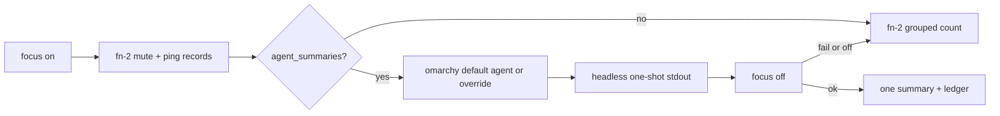

# Focus-mode agent notification summary

> HTML render lens: [.flow/artifacts/fn-3-focus-mode-agent-notification-summary/spec.html](../artifacts/fn-3-focus-mode-agent-notification-summary/spec.html) — regenerable, markdown is the record. <!-- flow-next:artifact-link -->

## Conversation Evidence

> user (turn 1): "summary is good. Note that we should spec out a feature where if user has an agent defined the user can configure the distraction-space to have the agent parse them during focus mode (inaccessible summary in the background) and one summary of important things will be presented at the end"
> user (turn 2): "yes capture that as fn-3"
> user (turn 3): "omarchy lets you define an agent and we should use the one the user has defined. The plugin should keep a ledger on what important means to the user. So the user could say summary not helpful or helpful and leave feedback. That'll be stored to inform the next summary parse."
> user (turn 4): "user will have to choose one but i think i can only enable one?"
> user (turn 5): "there's a default agent set"
> user (turn 6): "i guess you could override it to a cli app"
> user (turn 7): "any of the ones that omarchy allows as an agent"
> user (turn 8): "we should have basically the same selector modal that omarchy has for our summary agent"
> user (turn 9): "well any of them that allow headless invocation like claude -p or similar"
> user (turn 10): "the user needs to enable agent summaries in the plugin. Having an agent in omarchy doesn't immediately consent to agent summaries."

## Goal & Context
<!-- scope: business -->
<!-- Source-tag breakdown: 80% [user] / 20% [paraphrase] -->

The mute spec already hides banners and sounds, then shows a grouped per-app count when focus turns off. That count is a thin catch-up. This spec adds an optional path the user must turn on in the plugin. Having an Omarchy default agent is not consent. Once enabled, the plugin uses that default agent to read blocked pings during focus, in the background, and the user gets one summary of important things when focus turns off. The user can override that default with the same kind of selector modal Omarchy already uses, limited to agents that can run a one-shot headless prompt. After each summary, the user can mark it helpful or not and leave feedback. That ledger shapes the next parse. Focus mode still works with agent summaries off. The grouped count stays the catch-up until the user enables this path.

## Overview

This path stays off until `agent_summaries` is true in plugin config. The plugin then resolves one Omarchy agent id, runs that agent's documented print/run/exec one-shot with the blocked-ping text plus the ledger, and stores stdout until focus turns off. The user sees one summary, then a helpful / not-helpful note. Mute still owns banners, sounds, and the grouped-count fallback.

## Architecture & Data Models
<!-- scope: technical -->
<!-- Source-tag breakdown: 70% [paraphrase] / 30% [inferred] -->

The mute spec owns blocking and the grouped-count fallback. This spec consumes the blocked-ping records that mute writes and never applies or lifts mute itself.

**Consent and identity.** `~/.config/omarchy/focus.json` gains `agent_summaries` (boolean, default false) and `summary_agent` (Omarchy agent id or null). Null means "use Omarchy's default." `distractions` reads the default with `omarchy default agent` (no args), which prints the id in `~/.config/omarchy/defaults/agent` and prints nothing when unset ([Omarchy AI manual](https://raw.githubusercontent.com/basecamp/omarchy/quattro/manual/17-ai.md), [`bin/omarchy-default-agent`](https://github.com/basecamp/omarchy/blob/quattro/bin/omarchy-default-agent)). A plugin override does not write that Omarchy file.

**Picker.** Override and the on/off enable use `omarchy-menu-select`, the same `omarchy.menu` select-mode modal Omarchy already uses as dmenu ([`docs/menu.md`](https://github.com/basecamp/omarchy/blob/quattro/docs/menu.md), [`bin/omarchy-menu-select`](https://github.com/basecamp/omarchy/blob/quattro/bin/omarchy-menu-select)). Agent rows reuse the labels in `setup.default.agent.*` from [`default/omarchy/omarchy-menu.jsonc`](https://github.com/basecamp/omarchy/blob/quattro/default/omarchy/omarchy-menu.jsonc). The offered set is only ids in the closed headless table.

**Headless invoke.** The plugin does not call `omarchy agent` or `omarchy agent prompt`. Those launch an unattended interactive TUI ([`bin/omarchy-agent`](https://github.com/basecamp/omarchy/blob/quattro/bin/omarchy-agent), [`bin/omarchy-agent-prompt`](https://github.com/basecamp/omarchy/blob/quattro/bin/omarchy-agent-prompt), [Omarchy CLI](https://learn.omacom.io/2/the-omarchy-manual/115/omarchy-cli)). The plugin spawns the agent's own one-shot argv from the closed table, passes ping text plus ledger as the prompt, and captures stdout. The one-shot is a summarizer. It is not Omarchy's coding launch, so the plugin does not pass auto-approve / yolo / bypass-permissions flags.

Closed table (Omarchy ids from `omarchy-default-agent` / Setup > Defaults > Agent):

| id | One-shot argv | Source |
|----|---------------|--------|
| claude | `claude -p --output-format text` | [Claude Code CLI](https://code.claude.com/docs/en/cli-reference) |
| codex | `codex exec` (read-only sandbox default) | [Codex CLI `exec`](https://developers.openai.com/codex/cli/reference.md) |
| opencode | `opencode run` | OpenCode non-interactive `run` |
| crush | `crush run` | `omarchy-agent` comment: `crush run` never prompts |
| grok | `grok -p` | Grok Build print mode |
| omp | `omp --print` | [Oh My Pi settings](https://github.com/can1357/oh-my-pi/blob/main/docs/settings.md) |
| ori | `ori code` without `--interactive` | `omarchy-agent` comment: a prompt alone is one headless turn |
| pi | `pi` print / one-shot flag the binary documents | omit from the picker if the installed binary has none |
| copilot | `copilot -p` non-interactive print | Copilot CLI print mode |
| agy | `agy -p` | [Antigravity headless](https://antigravity.google/docs/cli/headless/) |

Empty stdout, non-zero exit, missing binary, or an id outside this table is a parse failure (R1). `agy -p` can exit 0 with empty stdout on a non-TTY; treat that as R1.

**Focus-on parse.** After mute is applying, the first blocked-ping record starts one background one-shot. The prompt is the current record list plus ledger JSONL. The child writes stdout to a state-dir result file under flock (same lock style as `listen()`). The file is not shown and has no CLI read while focus is on (R2). If the buffer grows after the child exits and focus is still on, a replacement parse may run. Focus-on again cancels the child and discards an unread result.

**Focus-off.** After a valid reason and `disable_focus()`, wait once for an in-flight child (bounded timeout, then kill). Success and a non-empty summary show one notice (longer `omarchy-notification-send` timeout than the 4000 ms default) and then a zenity helpful / not-helpful plus optional note. That path suppresses the mute grouped-count notice for this session. Off, no default, empty buffer, timeout, or any invoke/display failure uses the mute grouped count (R4, R6). The `focus-off` argv/stdin path runs the same chain.



## API Contracts
<!-- scope: technical -->

Plugin config in `~/.config/omarchy/focus.json` (existing `log` key unchanged):

```json
{
  "log": "~/.local/state/omarchy/focus-disable.log",
  "agent_summaries": false,
  "summary_agent": null
}
```

`summary_agent` is null or one closed-table id. A rejected write leaves the previous object unchanged.

Blocked-ping record this spec consumes (mute writes; this spec does not invent a second buffer):

```json
{ "app": "string", "title": "string", "body": "string", "at": "ISO-8601" }
```

Ledger line, append-only JSONL under `~/.local/state/omarchy/`:

```json
{ "at": "ISO-8601", "helpful": true, "note": "string" }
```

`note` may be empty. A rejected line is not appended.

CLI additions on `distractions`, same style as `focus` / `focus-status`:

- `agent-summaries` opens the select modal for on / off and writes `agent_summaries`.
- `summary-agent` opens the select modal for the closed-table ids and writes `summary_agent`, or clears the override when the user picks "Omarchy default".
- No command prints the running parse or result file while focus is on.

## Edge Cases & Constraints
<!-- scope: technical -->

- Empty ping list at focus-off. No summary, no ledger prompt. Mute already shows no notice when nothing was blocked.
- Summaries on, Omarchy default unset, no override. R4.
- Binary missing or id not in the closed table. R1 at focus-off, then R6.
- Child still running at focus-off. One wait with timeout, then kill, R1, R6.
- SIGINT / crash of `distractions` while a child is running. The next focus-off treats a missing or stale result as R1.
- Two focus toggles at once. Flock the result and ledger files. The bar already skips a second `Process` while one runs; Super+Ctrl+Shift+F can still race the CLI.
- Focus-on during an in-flight parse. Cancel the child. Discard unread stdout. Start fresh if summaries are still on.
- Reason zenity cancel. Stay focused. Do not show a summary.
- Ledger write failure after a shown summary. Tell the user. Keep the summary. Next parse may lack the new line (R10).
- Picker cannot open (`omarchy-menu-select` missing or cancel). Previous setting stays. Tell the user (R12).
- `agy -p` empty stdout on a pipe. R1, not a silent success.

## Acceptance Criteria
<!-- scope: both -->

- **R1:** When an agent is configured, that agent parses blocked distraction-space notifications in the background while focus mode is on. Errors: if the parse fails, the plugin tells the user when focus turns off. [paraphrase]
- **R2:** The running parse and any in-progress summary stay inaccessible until focus turns off. Errors: no error surface beyond R1. [user]
- **R3:** When focus turns off and an agent is configured, the user sees one summary of important things, not each original ping. Errors: if the summary cannot be shown, the plugin tells the user. [user]
- **R4:** When no agent is configured, this spec does not change the mute spec's grouped-count catch-up. Errors: no error surface. [paraphrase]
- **R5:** The user can point the plugin at an agent they already have, without rebuilding or reinstalling. Errors: a rejected setting leaves the previous agent setting unchanged. [paraphrase]
- **R6:** If the agent path fails, the mute spec's grouped-count notice still applies. Errors: no error surface beyond R1 and R3.
- **R7:** When no override is set, the plugin uses Omarchy's default agent. Errors: if Omarchy has no default agent, R4 applies. [user]
- **R8:** The user can override the default to any agent Omarchy allows as an agent. Errors: a rejected override leaves the previous setting unchanged. [user]
- **R9:** After a summary, the user can mark it helpful or not helpful and leave feedback. Errors: a rejected note is not stored; earlier ledger entries stay. [user]
- **R10:** The plugin stores that feedback in a ledger that informs the next summary parse. Errors: if the write fails, the plugin tells the user; the summary already shown stays; the next parse may lack the new entry. [user]
- **R11:** The override set is only Omarchy-allowed agents that support headless invocation, a one-shot prompt with no interactive session. Errors: an agent that cannot run that way is not offered. [user]
- **R12:** The override picker is the same kind of selector modal Omarchy uses for its default agent. Errors: if the picker cannot open, the previous setting stays and the plugin tells the user. [user]
- **R13:** Agent summaries stay off until the user enables them in the plugin. An Omarchy default agent alone does not turn them on. Errors: while off, R4 applies. [user]

## Boundaries
<!-- scope: business -->

- Notification mute, banners, sounds, and the no-agent grouped count stay the mute spec. [paraphrase]
- Network destination blocking stays the network spec. [paraphrase]
- Focus mode does not require an agent, and an Omarchy default agent is not consent to send pings to it. [user]
- Peeking at the running parse while focus is on is out of scope. [user]
- An override that is not an Omarchy-allowed agent, or that cannot run headless, is out of scope. [user]
- `omarchy agent prompt` and any interactive TUI launch are out of scope.
- A history screen of past summaries and per-app notification toggles stay declined (`.flow/memory/declined/notification-extra-ui.md`).
- Allow-lists and urgent bypass stay declined (`.flow/memory/declined/notification-exceptions.md`).
- Changing Omarchy's own default-agent file from this plugin is out of scope.

## Decision Context
<!-- scope: both -->

### Motivation
<!-- scope: business -->

The mute spec's grouped count is enough to ship. The user asked for a later path where an agent reads the blocked pings during focus and returns one important-things summary at the end.

The agent is Omarchy's default agent, and only after the user enables agent summaries in this plugin. The user can override it through the same kind of selector modal Omarchy already uses. The offered set is only agents Omarchy allows that can run a one-shot headless prompt. The plugin does not invent its own agent list.

What counts as important is a ledger. Helpful / not-helpful plus optional feedback after each summary shapes the next parse.

This is a sibling of the mute spec, not a rewrite of it. Same focus-mode gate. Different surface.

### Implementation Tradeoffs
<!-- scope: technical -->

Plan resolved the parked invoke question against Omarchy. The plugin reads `omarchy default agent`, picks with `omarchy-menu-select` (same modal as Setup > Defaults > Agent), and runs a closed argv table of print/run/exec one-shots. It does not call `omarchy agent prompt`.

R6 was captured as `[inferred]`. Repo-scout and spec-scout confirmed mute owns the grouped-count notice and this spec sits on top of it, so the tag is dropped and the criterion stays.

Rejected `omarchy agent prompt` as the invoke path. That command starts an unattended interactive TUI (`--permission-mode auto` and cousins) and is not a one-shot print.

Rejected a second agent catalog. The id list is Omarchy's (`omarchy-default-agent` plus `setup.default.agent.*`).

Rejected a QML settings panel. Enable and override are `omarchy-menu-select` plus two `distractions` commands, matching the existing CLI/zenity plugin.

Declined extra notification UI and mute exceptions stay closed. This spec does not reopen a history browser, per-app toggles, or an allow-list.

## Resolved via Project Docs

- `README.md`: Focus mode is on by default. Super+D is the only way into the distraction space, and only after focus is off. Turning focus off requires a zenity reason of at least 50 characters. The bar control is an eye icon.
- `.flow/specs/fn-2-focus-mode-distraction-notification.md`: Sibling mute + grouped-count catch-up. This spec consumes its blocked-ping records and keeps that count as the fallback.
- `.flow/specs/fn-1-focus-mode-network-distraction-block.md`: Sibling network block. This spec does not take it over.
- `.flow/memory/declined/notification-extra-ui.md`: No history screen, no per-app toggles.
- `.flow/memory/declined/notification-exceptions.md`: No allow-list, no urgent bypass.
- [The Omarchy Manual](https://learn.omacom.io/2/the-omarchy-manual), [Omarchy CLI](https://learn.omacom.io/2/the-omarchy-manual/115/omarchy-cli), [AI chapter (quattro `manual/17-ai.md`)](https://raw.githubusercontent.com/basecamp/omarchy/quattro/manual/17-ai.md): default agent, `omarchy agent prompt`, Setup > Defaults > Agent.
- `basecamp/omarchy` quattro: `bin/omarchy-default-agent`, `bin/omarchy-agent`, `bin/omarchy-agent-prompt`, `bin/omarchy-menu-select`, `docs/menu.md`, `default/omarchy/omarchy-menu.jsonc`.

## Resolved via Codebase

- `distractions:180-198`: `enable_focus()` / `disable_focus()` are the hook points.
- `distractions:200-234`: zenity reason pattern to follow for feedback.
- `distractions:37-44`: `notify()` via `omarchy-notification-send`.
- `distractions:47-54`: `load_config()` for `focus.json`.
- `distractions:237-260`: `fcntl` flock pattern for the parse result.
- `focus.json`: `log` only today.
- `manifest.json`: `kinds: ["bar-widget"]`. No settings schema. Bar stays the eye toggle.

## Quick commands

```bash
python3 -m py_compile distractions
./distractions focus-status; echo $?
./distractions agent-summaries   # after .1: select modal, writes agent_summaries
./distractions summary-agent     # after .1: select modal, writes summary_agent
```

No in-repo test harness (repo-scout: glob `*test*` is empty). `py_compile` plus the two new commands are the smoke.

## Early proof point

Task fn-3-focus-mode-agent-notification-summary.1 proves the invoke path. `omarchy default agent` resolves, `omarchy-menu-select` can write an override, and one closed-table argv returns stdout (or a clear failure) without opening a TUI.

If it fails, re-evaluate the argv table and the select-modal integration before wiring focus-on.

## Requirement coverage

| Req | Description | Task(s) | Gap justification |
|-----|-------------|---------|-------------------|
| R1 | Background parse while focus is on | fn-3-focus-mode-agent-notification-summary.2 | — |
| R2 | Parse inaccessible until focus-off | fn-3-focus-mode-agent-notification-summary.2 | — |
| R3 | One important-things summary at focus-off | fn-3-focus-mode-agent-notification-summary.2 | — |
| R4 | No agent leaves grouped count unchanged | fn-3-focus-mode-agent-notification-summary.2 | — |
| R5 | Point at an existing agent without rebuild | fn-3-focus-mode-agent-notification-summary.1 | — |
| R6 | Agent-path failure still uses grouped count | fn-3-focus-mode-agent-notification-summary.2 | — |
| R7 | No override uses Omarchy default agent | fn-3-focus-mode-agent-notification-summary.1 | — |
| R8 | Override to an Omarchy-allowed agent | fn-3-focus-mode-agent-notification-summary.1 | — |
| R9 | Helpful / not-helpful plus optional note | fn-3-focus-mode-agent-notification-summary.3 | — |
| R10 | Ledger informs the next parse | fn-3-focus-mode-agent-notification-summary.3 | — |
| R11 | Only headless one-shot agents offered | fn-3-focus-mode-agent-notification-summary.1 | — |
| R12 | Same kind of Omarchy selector modal | fn-3-focus-mode-agent-notification-summary.1 | — |
| R13 | Off until enabled in the plugin | fn-3-focus-mode-agent-notification-summary.1 | — |
