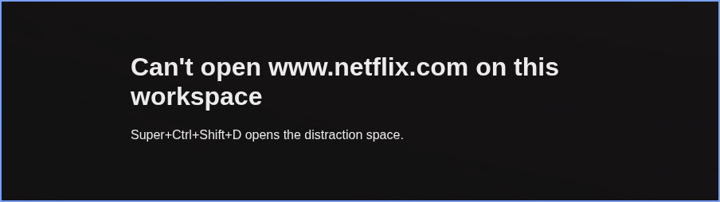
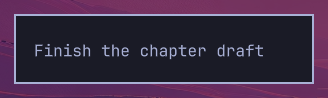
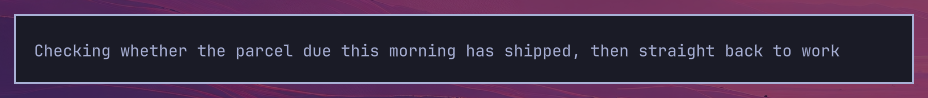
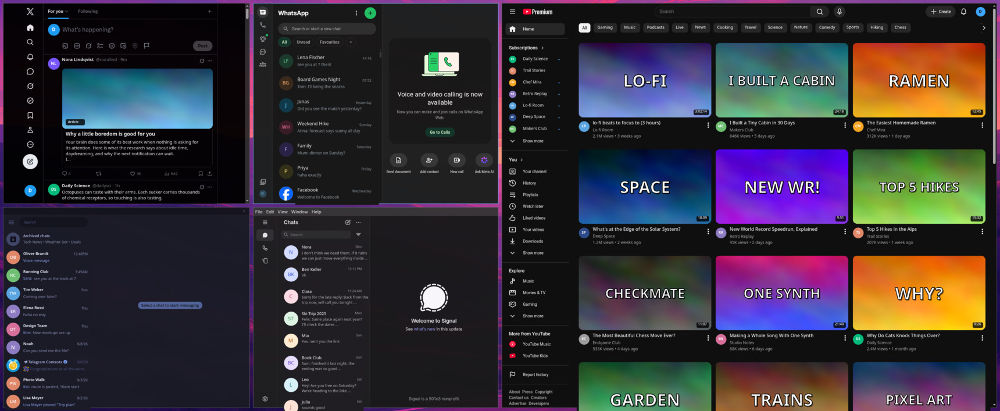

# Omarchy distraction space

An Omarchy plugin that makes your distractions hard to reach: the apps and sites that take your attention get one Hyprland workspace, the distraction space, and a lock can keep it shut.

- **Listed sites load only from the distraction space.** Netflix typed into your work browser out of habit gets a block page, or a closed connection and a banner over HTTPS; chat apps are only moved, so messages still arrive.\
  
- **A lock keeps the space shut for a set time.** Leaving early takes a written reason, 50 characters by default, and the plugin logs it.\
  \
  
- **Everything you list lives on the space.** Telegram, X, YouTube, and whatever else you list open there, and a window that lands anywhere else is moved back.\
  
- **Links open there, not in your work browser.** Say yes when setup asks, and a listed link clicked in any app lands on the space while you stay where you are, with a banner saying so.\
  
- **Notifications wait, with a count in the bar.** By default, listed apps pop no banners while you are off the space, and the bar shows how many are waiting.\
  
- **Their sounds stay muted** for as long as their notifications are held.
- **One line when you come back.** A single notice says what was held, per app, or, if you turn it on, one line from your own agent saying whether any of it needed you.

**How it works.** Every listed app and site the plugin opens runs in one process group, the systemd slice `app-distraction.slice`, and their windows belong to one workspace; listed web products get a browser profile of their own. A firewall rule keyed on that process group lets it reach the listed sites and refuses them to every other process, so a window left open on the space keeps syncing while your work browser is blocked. Windows, network, and sound follow which process group a program is in, never which workspace you happen to be looking at.

It is an attention aid with known gaps: web products need a Chromium-family browser, HTTPS never shows the block page, and a site served behind Encrypted Client Hello passes through. The [limits](docs/reference.md#limits) list them all.

## Install

You need Omarchy 4 and, for the web products, a Chromium-family browser such as Chrome, Brave, or Chromium.

```bash
omarchy plugin add https://github.com/DanielKillenberger/omarchy-distraction-space.git --enable
```

```bash
chmod +x ~/.config/omarchy/plugins/io.github.danielkillenberger.distraction-space/distractions
~/.config/omarchy/plugins/io.github.danielkillenberger.distraction-space/distractions setup
```

Setup asks for sudo once, to install the firewall helper and the sudoers grant that lets the listener run it without a password; the reference lists [everything setup writes](docs/reference.md#what-setup-installs) and how to [move a 3.x install that pasted the snippets by hand](docs/reference.md#moving-a-pasted-3x-install).

## Use

Log out and back in once so Hyprland's autostart starts the listener, or start it now:

```bash
~/.config/omarchy/plugins/io.github.danielkillenberger.distraction-space/distractions listen
```

| Action | Keys |
|---|---|
| Open or leave the space | Super+Ctrl+Shift+D |
| Move the focused window there | Super+Alt+D |
| Lock, or unlock when locked | Super+Ctrl+Shift+F |
| Next occupied workspace, skipping the space | Super+Tab |
| Previous occupied workspace, skipping the space | Super+Shift+Tab |
| Release the focused window from containment (commented out in the snippet) | Super+Ctrl+Shift+E |

The bar widget answers a left click with lock or unlock, a right click with the menu, and a middle click with the toggle. A quiet dot marks degraded or unknown operation; the tooltip and the menu's Status action explain why. It keeps the lock and held-count display, watches state changes, and checks status every 30 seconds so a stopped listener becomes visible even when no file changes. This check pings the listener and reads saved observations; it does not run privileged firewall probes.

## Configure

Settings live in `~/.config/omarchy/distraction-space.json`, and missing keys take the default. `distractions menu` edits the list, the nudges, the hold, the mute, the lock, and the summary, and `distractions config set <key> <value>` changes one key; the [key table](docs/reference.md#configuration) has every key and its default. `distractions catalog` prints the 19 products the plugin knows, and `distractions list add <name>` adds one.

## Remove

```bash
~/.config/omarchy/plugins/io.github.danielkillenberger.distraction-space/distractions setup --remove
omarchy plugin remove io.github.danielkillenberger.distraction-space
```

Run `setup --remove` first, because the plugin directory holds the script that does the removing. It hands your default browser back and undoes everything setup wrote, and it leaves the distraction browser profile in place and prints its path so you can delete it yourself. The reference lists [every step it takes](docs/reference.md#remove).

## Contributing

```bash
PATH=/usr/bin:$PATH python3 -m unittest discover -s tests
```

The suite runs offline, and a change needs nothing else: clone, run it, and open a pull request with code, tests, and docs. [CONTRIBUTING.md](docs/CONTRIBUTING.md) covers the rest.

## More

- [Reference](docs/reference.md): requirements, everything setup writes, how each feature works, the limits, and every config key and command.
- [Internals](docs/internals.md): the listener loop, the state files, the network table, and the notification-service clone, for reading or changing the code.
- [Contributing](docs/CONTRIBUTING.md): the offline suite, CI, linting the bar widget, and the maintainer's task tracking.
- License: MIT. See [`LICENSE`](LICENSE).
